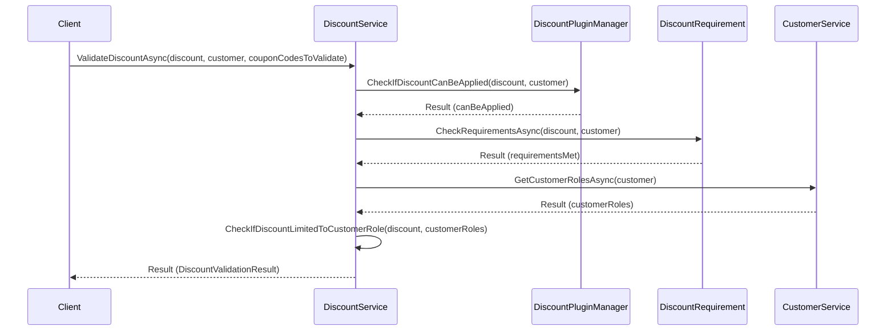

# DiscountService Class

**Description:** This class provides services related to discounts.

## Public Methods

### `Task DeleteDiscountAsync(Discount discount)`

**Parameters:**

- `Discount discount`: The discount to delete.

**Return Type:** Task

**Description:** Deletes a discount.

### `Task<IList<Discount>> GetAppliedDiscountsAsync<T>(IDiscountSupported<T> entity)`

**Parameters:**

- `IDiscountSupported<T> entity`: Entity which supports discounts.

**Return Type:** Task<IList<Discount>>

**Description:** Gets discounts applied to entity.

### `Task<Discount> GetDiscountByIdAsync(int discountId)`

**Parameters:**

- `int discountId`: Discount identifier.

**Return Type:** Task<Discount>

**Description:** Gets a discount by its identifier.

### `Task<DiscountUsageHistory> GetDiscountUsageHistoryByIdAsync(int discountUsageHistoryId)`

**Parameters:**

- `int discountUsageHistoryId`: Discount usage history record identifier.

**Return Type:** Task<DiscountUsageHistory>

**Description:** Gets a discount usage history record.

### `Task InsertDiscountAsync(Discount discount)`

**Parameters:**

- `Discount discount`: The discount to insert.

**Return Type:** Task

**Description:** Inserts a discount.

### `Task UpdateDiscountAsync(Discount discount)`

**Parameters:**

- `Discount discount`: The discount to update.

**Return Type:** Task

**Description:** Updates a discount.

### `Task<DiscountValidationResult> ValidateDiscountAsync(Discount discount, Customer customer, string[] couponCodesToValidate)`

**Parameters:**

- `Discount discount`: The discount to validate.
- `Customer customer`: The customer to validate the discount for.
- `string[] couponCodesToValidate`: The coupon codes to validate.

**Return Type:** Task<DiscountValidationResult>

**Description:** Validates a discount.

